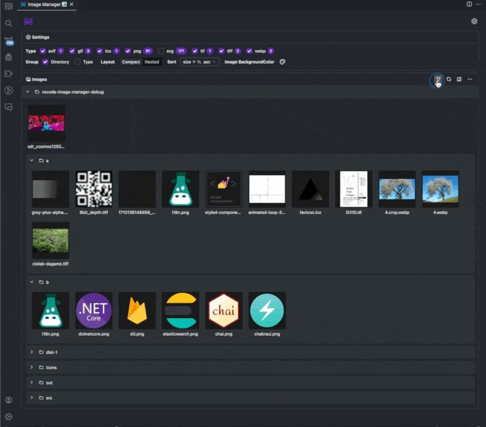

# VSCode Image Manager

[vscode-image-manager 插件下载地址](https://marketplace.visualstudio.com/items?itemName=minko.image-manager)
> 一款集压缩、裁剪、查找、预览大图等功能于一体的vscode插件，帮助开发者高效率管理图片

## 压缩
包括批量压缩、过滤已压缩图片等功能 
## 裁剪

## 大图预览

## 查找

## 过滤
## 
## 主题、国际化等UI自定义功能

