日常功能中经常跟图片打交道，但是操作系统和vscode的图片方面体验并不好，比如在macos上，图片底色永远是白色，而且导致看不清，尤其是在许多图中用眼睛找某个图的时候，简直亮瞎眼...
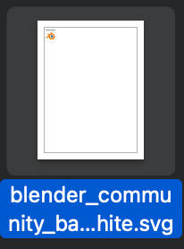
在vscode中，预览图片有丰富的插件，但仅限于对单张图片的预览，所以好像也不是很方便
在动手之前，我还是先找了一下有没有更好用的图片查看器，还真让我找到了 `[vscode.image-viewer](https://github.com/ZhangJian1713/vscode-image-viewer)`，这个插件实现了基本的预览功能
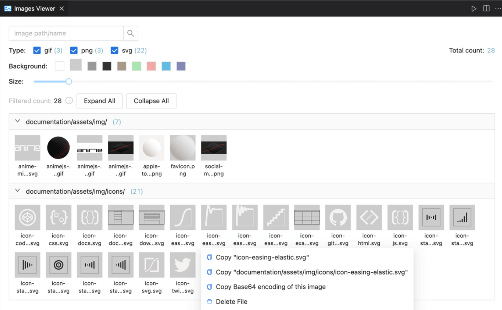

但由于太闪眼睛了，且没有我想要的压缩、裁剪功能，于是我还是动手自己做一个。（在此感谢 `vscode.image-viewer`扩展）

# 扩展地址
[扩展地址](https://marketplace.visualstudio.com/items?itemName=minko.image-manager) 在这里，点击即可下载。
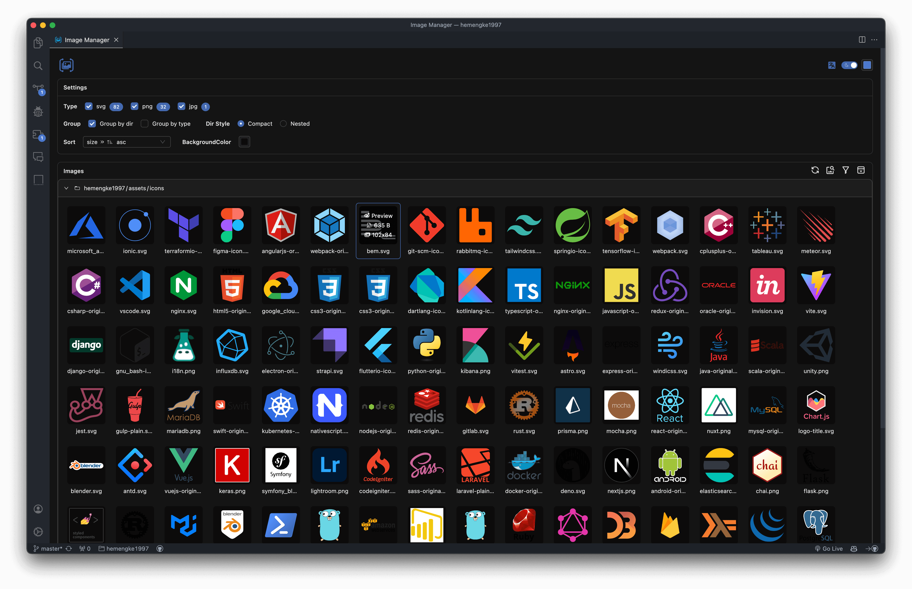
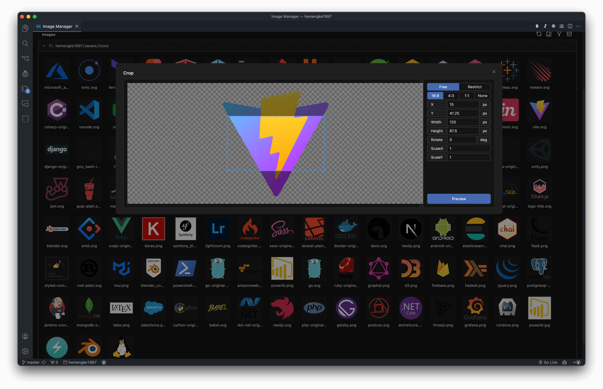
下文是写这个扩展时的心路历程。多图警告 ⚠️
# 我需要什么功能？
做东西一定要有个目标，而我的首要目标是满足自己的需求，所以我早早地就列出了我想要的功能：

1. 像操作系统的文件夹那样查看图片（目录树）
2. 大图预览
3. 可以筛选图片
4. 可以排序，把大图找出来
5. 可以根据名称查找图片
6. 必须有暗黑模式，白色太刺眼了，哈哈
7. 可以像操作系统那样复制、粘贴、移动图片
8. 压缩图片
9. 裁剪图片
10. 相似图片智能分析
11. OCR

对以上需求分个类，其实就是 RUD。那肯定要先把 R(read) 给做出来，也就是图片查看、预览等，都是“看”的功能
# “查看”
分析一下需求，对“看”相关的做个先后排序

1. 暗黑模式
2. 目录树
3. 大图预览
4. 图片排序、筛选
5. 查找图片
## 暗黑模式
之所以先做暗黑模式，是因为其与主功能无关，且又是最基础的功能
我使用的 react 来写webview，自然而然UI库是用 antd 了。我开发扩展时，碰巧 antd 出了 5.12.0 支持[css变量模式](https://ant.design/docs/react/css-variables-cn)，所以我集成了 tailwindcss，方便使用 antd css变量。
antd的暗黑模式很简单，只需要设置 ConfigProvider 的 theme 即可
```tsx
<ConfigProvider
  theme={{
    hashed: false,
    cssVar: true,
    algorithm: theme === 'dark' ? 
      antdTheme.darkAlgorithm : antdTheme.defaultAlgorithm,
  }}
  >
</ConfigProvider>
```
问题是，怎么跟tailwind集成？我想在jsx中这样写：
```tsx
<div className='text-ant-color-primary'></div>
```
这样可以很方便是用antd的css变量。tailwind提供了 plugin 和 preset 功能，在tailwind config 中配置：
```typescript
module.exports = {
  presets: [{
    theme: {
      extend: {
        colors: {
          'ant-color-primary': 'var(--ant-color-primary)',
        }
      }
    }
  }]
}
```
配置后，如果你已经安装vscode的tailwind插件，还可以有智能补全的功能
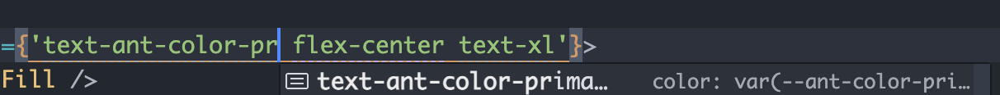

可是，antd这么多变量，总不能一个一个去手动配置吧。那就写个脚本来生成吧
首先，我们把 antd 的 css 变量拷贝出来，这个简单，随便启动个带antd@5.12.x的项目就行（如果这样也麻烦的话，就去antd官网打开f12）
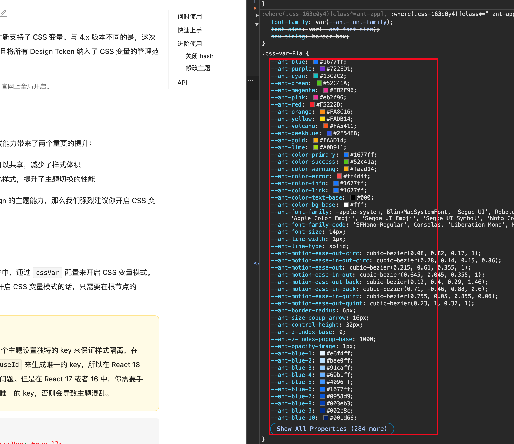
拷贝出来后放在css文件中，我们只需要对象的key，因为value是动态变化的。

接下来，我们需要解析这个css，得到这样的 `'ant-color-primary': 'var(--ant-color-primary)'`格式
要解析js，我们自然会想到babel，要解析css，同理也会想到postcss。用postcss遍历css，获取到每个css变量，然后输出到js文件中，就可以在tailwind中引入了！
我把这个css集成封装到了 `[tailwind-antd-preset](https://github.com/hemengke1997/tailwind-antd-preset)`，安装即可使用了
```javascript
module.exports = {
	presets: [require('tailwind-antd-preset')]
}
```
重启tailwindcss插件后，可以看到
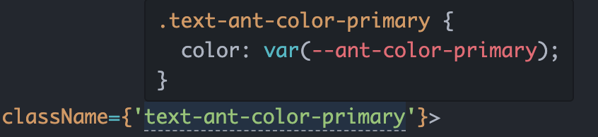
至此，关于主题，我们就有了个很舒服的开发体验
## 目录树
我需要展示项目中所有的图片，那首先得把图片都找出来吧？这简单，在 vscode 环境中，使用 `node:fs` 就遍历项目就能全部找出来了。在这里我使用了 `[fast-glob](https://www.npmjs.com/package/fast-glob)` 来实现
很简单：
```typescript
import fg from 'fast-glob'

const imgs = await fg(all, {
  cwd: path.posix.normalize(absWorkspaceFolder),
  objectMode: true,
  dot: false,
  absolute: true,
  markDirectories: true,
  stats: true,
})
```
得到的结果是一个对象数组，对象数据结构如下：
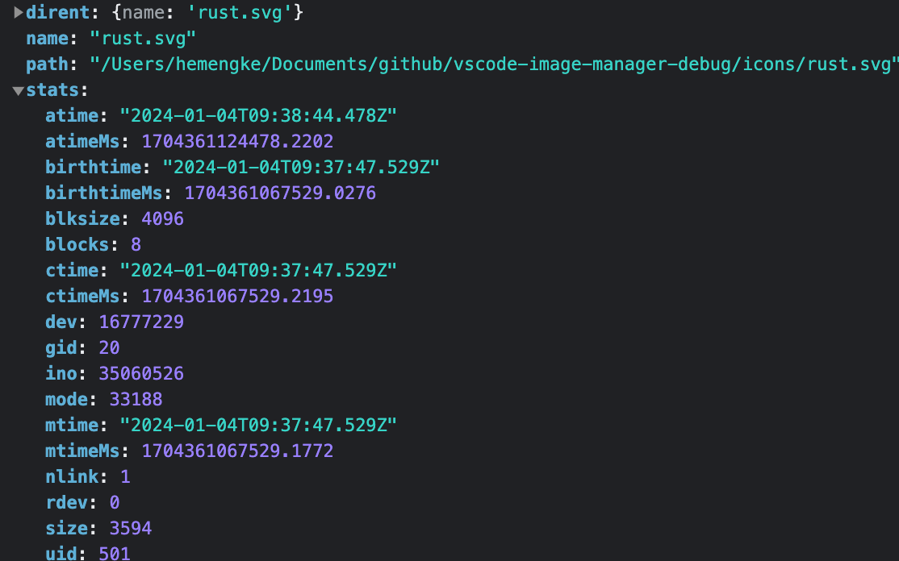
光有这些信息肯定不够用，还需要再丰富一下，解析出图片文件的目录、文件名、文件扩展名、项目路径等等，这些只需要是用 `node:path`即可解析出来

最后给到页面的图片对象数据结构是这样的：
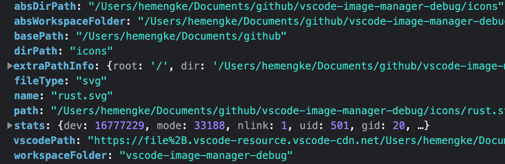

ok，现在webview拿到了图片对象数组，就得处理这个数组，用一个 human-friendly 的方式把图片展示出来了，也就是我的需求中的 “像操作系统的文件夹那样查看图片”。师爷，翻译翻译什么是 “像操作系统的文件夹那样查看图片”。
师爷：“像操作系统的文件夹那样查看图片” 就是把数组转成树，每个节点都是一个目录，节点中有个属性，里面包含了当前节点的所有图片
顺着师爷的思路，我一番操作，把数组转成了目录树，最后展示效果如下：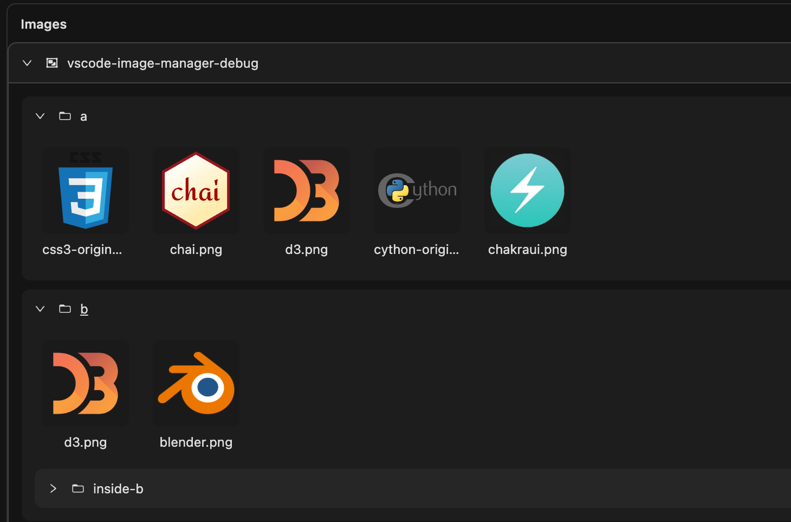
我不知足，我还想要按照图片类型分类查看。这是另外的价钱，得对树做一些处理，把文件的类型当作成目录。最后得到的效果如下：
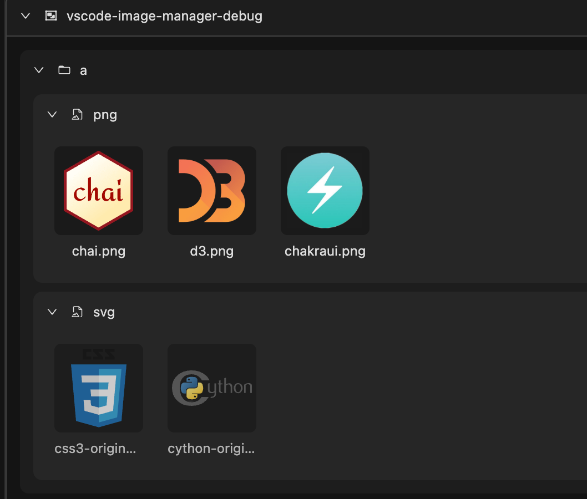
嗯，现在还可以，有点味道了

既然是一颗树，那么就一定有深度，如果树很深，但节点上并没有图片，很不方便！
vscode 的 explorer 就提供了紧凑展示的功能，Java 项目中很方便
紧凑模式：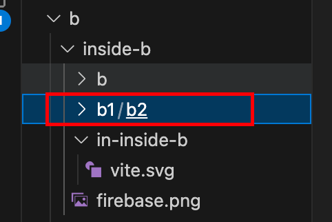
嵌套模式：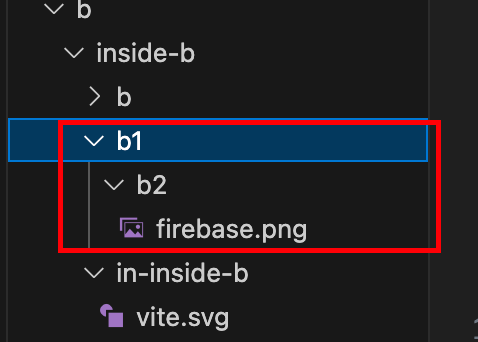

因为此扩展会查找项目中的所有图片，所以难免可能会出现树很深的情况，此时如果有紧凑模式，不是美滋滋吗？
ok，那再对树进行一些处理，遍历树节点，如果当前节点有子节点，且当前节点没有图片，那就把子节点指向当前节点。得到的效果是：
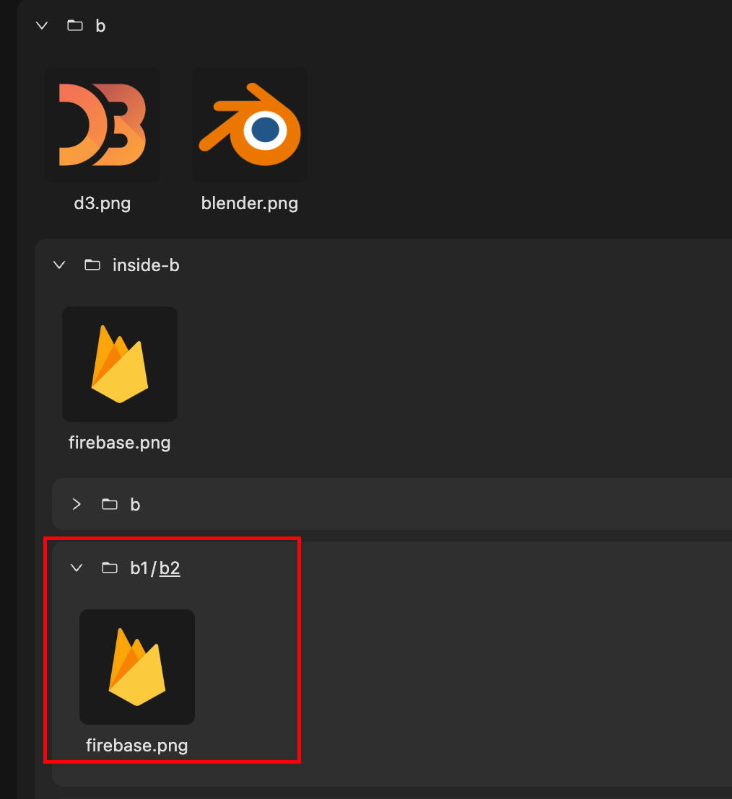
## 大图预览
antd 的 Image 组件自带了 PreviewGroup 功能，可以很方便实现预览。但缺点是其 preview-mask 自定义能力不太够，所以可能需要咱们多写一些代码来控制预览的逻辑
## 图片排序、筛选
把原始数组根据一定的规则排序就完事了
我想要大小排序、名称排序，还想根据大小筛选，这样我就能方便的找出大图了，为后续的压缩功能做铺垫。这些都是对数组的操作
```typescript
// 排序
function sortImages(sort: string[], images: ImageType[]) {
  images.sort((a, b) => {
    if (sort[0] === 'size') {
      return sort[1] === 'desc' ? b.stats.size - a.stats.size : a.stats.size - b.stats.size
    }
    if (sort[0] === 'name') {
      return sort[1] === 'desc' ? b.name.localeCompare(a.name) : a.name.localeCompare(b.name)
    }
    return 0
  })
  return images
}
```
这些操作其实在做React的List渲染。
平时我们开发时或许经常是用 index 来当key，但是在这种大列表的情况下，为了更好的性能，尽量是用唯一的id来作为key，这样就可以避免在排序、筛选等操作后，重复大量渲染造成掉帧的问题
## 查找图片
既然我都要查找图片了，很有可能我并记不起图片的全名了，所以接入模糊匹配比较好。如果能实现跟vscode差不多的搜索功能，就比较舒服了嘿嘿
我选择了 `fuse.js`来做查找，用法很简单：
```typescript
const fuse = new Fuse(allImages, {
  isCaseSensitive: caseSensitive, // 区分大小写
  minMatchCharLength: 2, // 最小的查找字数
  includeMatches: true, // 用于高亮关键字
  threshold: wholeWord ? 0 : 0.3, // 匹配精度，0表示全匹配，不丢失精度
  keys: ['name'], // 根据输入的数组对象中哪些key做查找
})

fuse.search('待查找的值')
```
接入后，就可以实现查找功能了，为了更好的展示效果，我们可以高亮关键词
最后得到这样的效果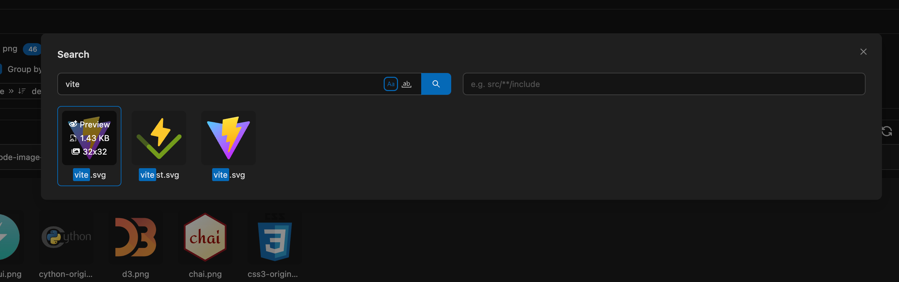
# 更新
关于“查看”的功能就差不多了，基础搭好了，就可以开始入手“更新”图片了
## 压缩
说到压缩，大部分前端开发应该都知道 `tinypng`。我也一直用它来压缩图片，但是每次都要上传、下载、解压、然后拷贝粘贴，一系列操作让我觉得很麻烦。这也是为什么我想做压缩功能
可是tinypng只提供了api，并且个人开发一个月只有500张免费额度，这是我无法接受的呀，所以我选择了另外一个方案：`[sharp](https://sharp.pixelplumbing.com/)`，一个高性能的图片操作库
### sharp
这个库抛出了一个难题给我，就是库是自动根据当前平台在安装时，下载对应的bin，比如我的机器是 macos，它就会下载 `sharp-darwin-arm64v8`版本。可是vscode扩展的对象可不止darwin用户，还有windows 或 linux，我应该怎么处理多平台呢？
我有过这些想法：

- 提前把bin下载好，全部打包到扩展中，按需使用
   - 缺点是打包体积很大，并且sharp没有提供cli，不好操作
- 在用户安装扩展时，我通过执行 sharp 内部的脚本来下载对应平台的bin
   - 缺点是操作难度大
- 在用户安装扩展时，使用 `npm install`安装依赖
   - 缺点是我们要严格处理依赖，不然安装后用户本地 node_modules 很大

如果你有更好的想法，请留下你的评论！
在实践之后，我选择了第三种方式
核心逻辑也就是判断用户环境是否有 npm，然后写 package.json，只安装必要依赖
```typescript

async function installSharp(extUri: string): Promise<'success' | 'fail' | 'installed'> {
  try {
    try {
      const sharp = require('sharp')
      if (sharp) {
        return 'installed'
      }
    } catch (e) {
    }

    const { pkgJsonBakPath, updatedPkgJson } = updatePackgeJson(extUri)
    const { stdout, failed } = (await npmInstall(extUri, updatedPkgJson)) || { stdout: '', failed: true }
    pkgJsonBakPath && fs.copyFileSync(pkgJsonBakPath, path.join(extUri, './package.json'))
    fs.unlinkSync(pkgJsonBakPath)

    if (stdout && !failed) {
      if (stdout.includes('up to date')) return 'installed'
      return 'success'
    }

    return 'fail'
  } catch (e) {
    return 'fail'
  }
}


async function npmInstall(extUri: string, pkgJson: Record<string, any>) {
  try {
    const res = await execa('npm', ['install'], {
      cwd: extUri,
      stdio: 'pipe',
    })
    return res
  } catch (e) {
    return null
  }
}
```
安装好了之后，提示用户reload vscode，不出意外就可以正常使用sharp了。这里有个点要注意，只能通过 `require` 或者 `await import` 这种“懒”的方式引入，因为最初的代码环境中是没有sharp的
然后就可以愉快使用sharp来压缩或者操作图片了，具体很简单：
```typescript
this._loadSharp()(filePath)
    .toFormat(ext as keyof SharpType.FormatEnum, {
      quality: this.compressOptions.quality,
      compressionLevel: this.compressOptions.compressionLevel,
    })
    .toBuffer()
    .then(async (buffer) => {
      try {
        const fileWritableStream = fs.createWriteStream(this.getOutputPath(filePath))
        fileWritableStream.on('finish', () => {
          const compressedSize = fs.statSync(ouputPath).size
          resolve({
            originSize,
            compressedSize,
          })
        })
        fileWritableStream.write(buffer)
        fileWritableStream.end()
      } catch (e) {
        reject(e)
      }
    })
    .catch((e) => {
      reject(e)
    })

private _loadSharp(): typeof SharpType {
    const _sharp = require('sharp')
    return _sharp
  }
```
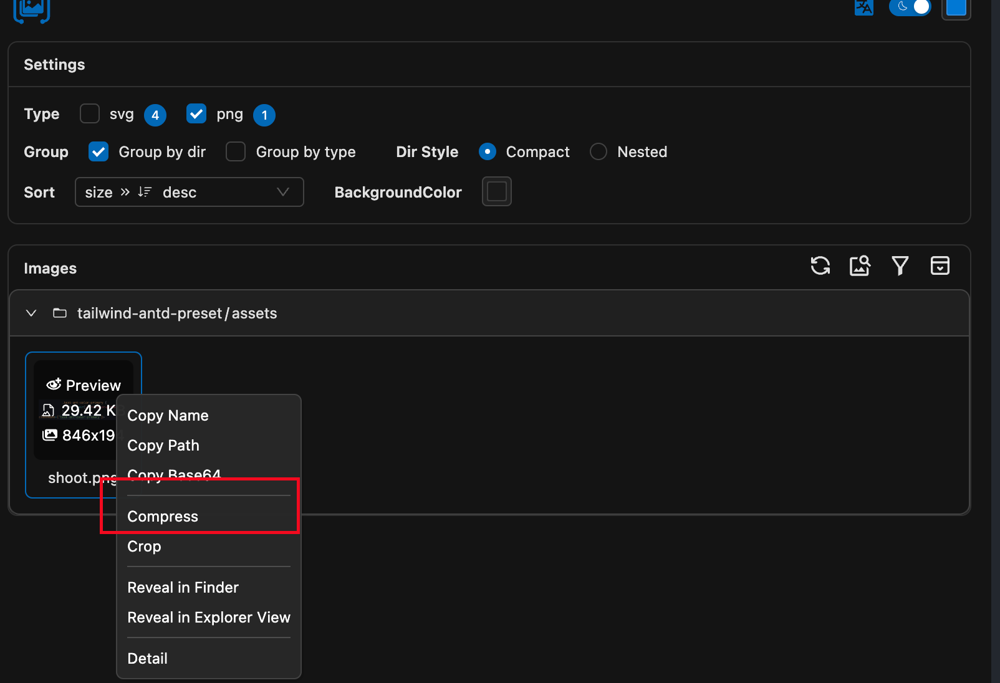
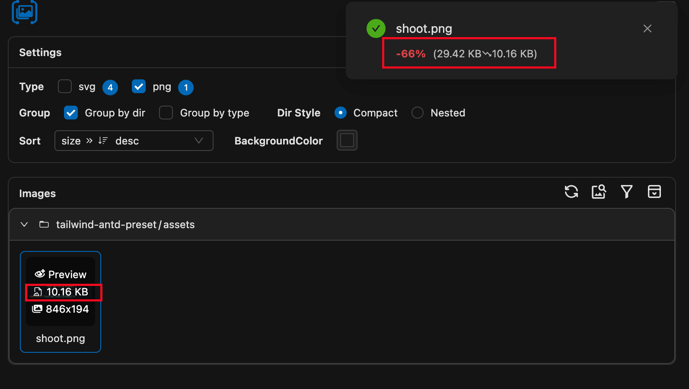
可以看到sharp还是比较给力的

由于npm安装并不稳定，一旦失败，压缩功能就没了。所以我决定再接入 tinypng 的api，有[官方现成的nodejs库](https://github.com/tinify/tinify-nodejs)，也可以伪造请求来做
### tinify
使用tinify api的前提是需要申请个人开发者账号，[在这里申请](https://tinypng.com/developers)
使用起来很简单：
```typescript
import tinify from 'tinify'

tinify.key = "YOUR_API_KEY";

tinify.fromFile("unoptimized.png").toFile("optimized.png");
```
### 伪造请求头
这个方案挺常见的，但是缺点请求会被官方限制
```typescript
const req = https.request(
  {
    method: 'POST',
    hostname: 'tinypng.com',
    path: '/backend/opt/shrink',
    headers: {
      'Cache-Control': 'no-cache',
      'Content-Type': 'application/x-www-form-urlencoded',
      'User-Agent':
        'Mozilla/5.0 (Macintosh; Intel Mac OS X 10_15_7) AppleWebKit/537.36 (KHTML, like Gecko) Chrome/120.0.0.0 Safari/537.36',
      'X-Forwarded-For': this._genRandomIP(),
    },
    agent: new https.Agent({ rejectUnauthorized: false }),
  },
  (res) => {
    res.on('data', (buffer: Buffer) => {
      const result = JSON.parse(buffer.toString()) as PostInfo
      // ...
    })
  },
)
```
这个就是伪造请求的核心方法

虽然能用，但是 `/backend/opt/shrink`这个接口tinypng官网已经没在用了，取而代之的是 store 上传 + process 处理 两个接口：
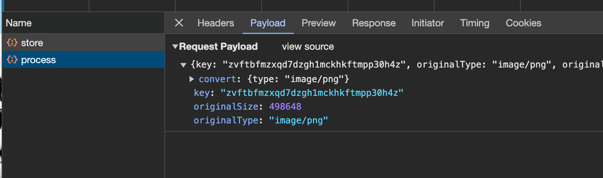
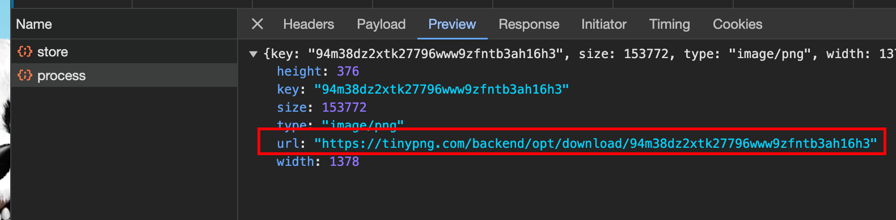
关键是这个请求process接口时带的key是怎么生成的，我还没去研究

综上，我做了三种压缩方案，最好是sharp，可以自行控制，tinypng api有限制，在少量压缩的情况下，还是可以使用的
## 裁剪
因为有时候设计切图不对称，作为一个成熟的前端切图仔，我也得自己切图！
裁剪功能是使用的 `cropper.js` 实现的，也有react版本，但是react版本的渲染控制得不太好，开发时没有hmr功能，而且也没法动态init，我fork了一份改了一下。最后实现了这样的效果：
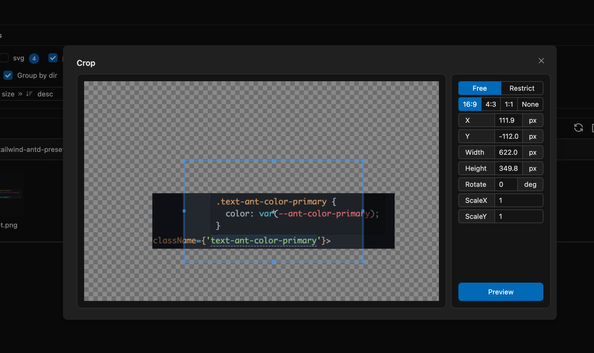
如果需要精确的像素，也可以在右边面板中控制。然后可以生成对应的裁剪好的图，可保存至本地
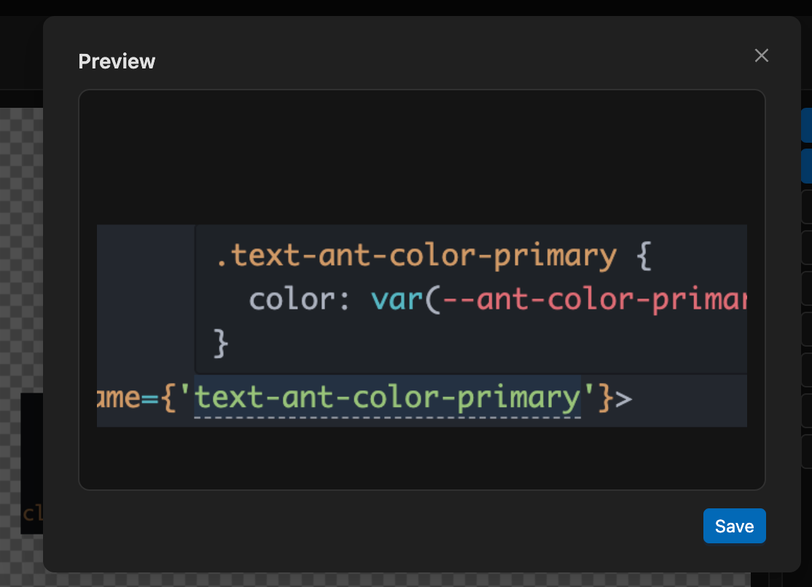

# 分析功能
相似图片分析和OCR，这两个还没想好怎么做


